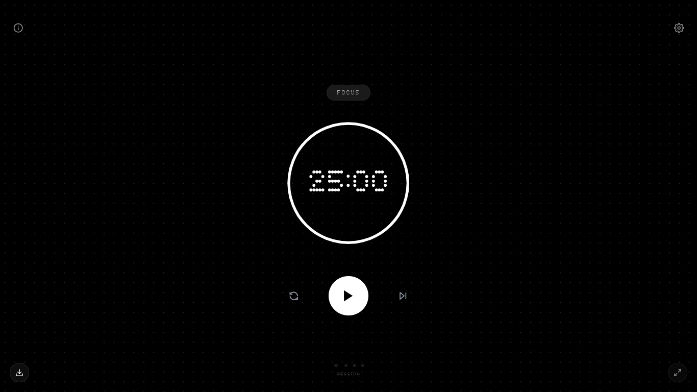

# Focus Flow

<!-- ここにスクリーンショットを配置してください -->

 

A Minimal, Nothing-Style Pomodoro Timer.
 
Designed for deep focus with digital elegance.

[Go to website](https://lineside0418.github.io/Focus/)

## 📖 Overview

Focus Flow は、"Nothing Phone" のようなドットマトリクスデザインと、Apple製品のような洗練されたミニマリズムを融合させたポモドーロタイマーです。
余計な装飾を削ぎ落とし、集中（Flow）状態に入るための最適なUI/UXを提供します。

Focus Flow is a Pomodoro timer that blends the dot matrix aesthetics of "Nothing Style" with the refined minimalism of Apple design.
Stripped of unnecessary distractions, it offers the optimal UI/UX to help you get into the "Flow".

## ✨ Features

Minimal & Aesthetic Design: ドットフォント（Ndot 55）とインタラクティブなアニメーション。

Immersive Mode: タイマー再生中はUIがフェードアウトし、時間だけに集中できます。

PWA Support: iOS、Android、PCにアプリとしてインストール可能。オフラインでも動作します。

Background Timer: Web Workerを使用し、ブラウザがバックグラウンドにあっても正確に時間を計測・通知します。

Smart Notifications: セッション終了時に、状況に合わせた通知を送ります（許可が必要）。

Customizable: 時間設定、ダークモード、サウンド、言語（日/英）などを設定可能。

Seamless Flow: オートスタート機能により、停止することなく次のセッションへ移行できます。

## 📱 Installation (PWA)

このアプリは PWA (Progressive Web App) として設計されています。

iOS (iPhone/iPad)

Safariでページを開く。

「共有」ボタンをタップ。

「ホーム画面に追加」を選択。

Android / PC (Chrome)

ページを開く。

アドレスバーのインストールアイコン、またはメニューから「アプリをインストール」を選択。

## 🛠️ Tech Stack

Core: HTML5, CSS3, JavaScript (Vanilla ES6+)

Styling: Tailwind CSS

Gestures: Hammer.js

Font: Ndot 55, Inter

Architecture: Single File Component structure (Logic separated in development, bundled for deployment)

## ⚙️ Configuration

画面右上の設定ボタン、または画面下部からのスワイプアップで設定画面を開けます。

Duration: Focus / Short Break / Long Break の時間をドラムロールで設定。

Enable Long Break: 長い休憩の有効/無効と、そのインターバル回数。

Notifications: デスクトップ通知の許可設定。

Dark Mode: 外観テーマの切り替え。

Sound Effects: 通知音と操作音のON/OFF。

Auto Start Next: セッション終了後、自動的に次のタイマーを開始するかどうか。

Language: 日本語 / 英語 の切り替え。

## 🤝 Contributing

バグ報告や機能追加の提案は Issues へお願いします。
Pull Requestも歓迎します。

Fork the repository

Create your feature branch (git checkout -b feature/AmazingFeature)

Commit your changes (git commit -m 'Add some AmazingFeature')

Push to the branch (git push origin feature/AmazingFeature)

Open a Pull Request

## 📄 License

Distributed under the MIT License. See LICENSE for more information.

Created by <a href="https://www.google.com/search?q=https://github.com/lineside0418">lineside0418</a>

